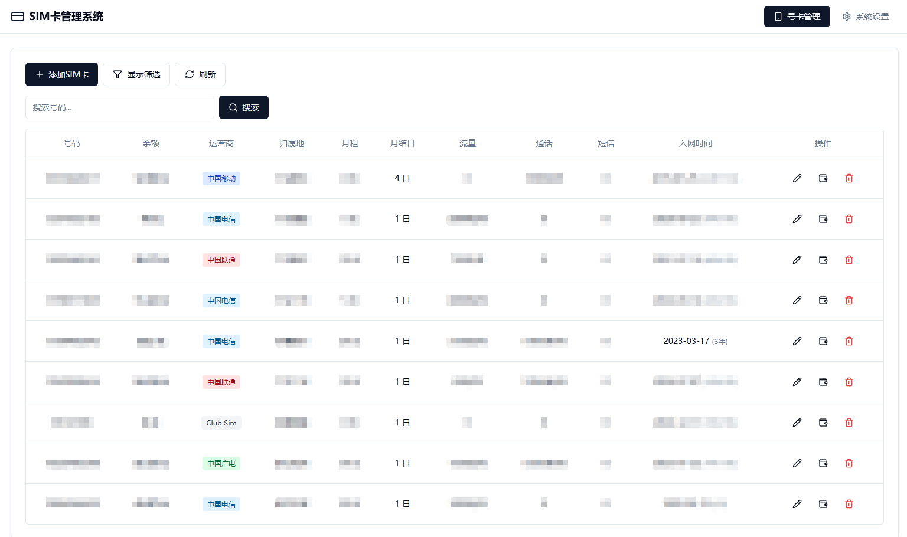
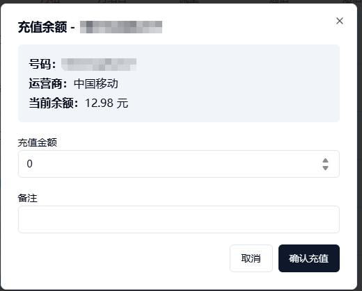
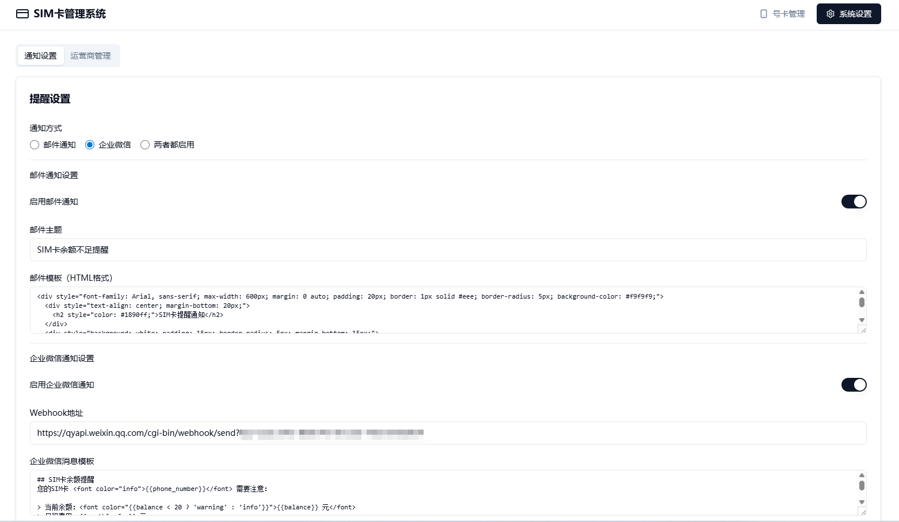

# Simnotice - SIM卡管理与提醒系统

一个用于管理SIM卡信息并提供余额不足提醒的系统。支持自动扣费和交易记录追踪功能。

## 项目截图





## 功能特点

- **SIM卡管理**：添加、编辑、删除SIM卡信息
- **信息展示**：号码、余额、运营商、月租、归属地、流量套餐等
- **智能排序**：按入网时间排序，显示入网时长
- **多条件筛选**：按号码、运营商、归属地、余额范围筛选
- **余额管理**：手动充值、自动扣费
- **余额提醒**：邮件或企业微信通知
- **交易记录**：完整的充值和扣费记录
- **运营商管理**：自定义运营商
- **响应式设计**：支持桌面端和移动端

## 技术栈

| 层级 | 技术 | 版本 |
|------|------|------|
| **前端框架** | React | 19.x |
| **构建工具** | Vite | 8.x |
| **前端语言** | TypeScript | 5.x |
| **UI组件库** | shadcn/ui | - |
| **样式框架** | Tailwind CSS | 4.x |
| **后端框架** | Express.js | 4.x |
| **后端语言** | JavaScript | - |
| **数据库** | SQLite (sql.js) | - |
| **邮件服务** | Nodemailer | 6.x |

## 项目结构

```
Sim_Notice/
├── frontend/                # React + TypeScript 前端
│   ├── src/
│   │   ├── components/ui/   # shadcn/ui 组件
│   │   ├── pages/           # 页面组件
│   │   ├── services/        # API 服务
│   │   ├── types/           # TypeScript 类型定义
│   │   └── lib/             # 工具函数
│   └── ...
│
├── backend/                 # Node.js 后端
│   ├── config/              # 配置文件（数据库、邮件）
│   ├── models/              # 数据模型
│   ├── routes/              # API 路由
│   ├── scripts/             # 脚本工具（初始化、迁移、定时任务）
│   ├── services/            # 业务服务（定时任务调度）
│   └── data/                # SQLite 数据库文件
│
└── images/                  # 文档截图
```

## 安装与启动

### 前提条件

- Node.js >= 18.x

### 安装步骤

1. **克隆项目**

2. **安装依赖**
   ```bash
   cd backend
   npm install
   
   cd ../frontend
   npm install
   ```

3. **配置环境变量**
   
   在 `backend` 目录创建 `.env` 文件：
   ```env
   # 服务器配置
   PORT=9501

   # 数据库配置（可选，默认使用 data/simnotice.db）
   # DB_PATH=./data/simnotice.db

   # 邮件配置
   EMAIL_HOST=smtp.your-email-provider.com
   EMAIL_PORT=465
   EMAIL_USER=your_email@example.com
   EMAIL_PASS=your_email_password
   EMAIL_FROM=your_email@example.com

   # 接收通知的邮箱
   RECIPIENT_EMAIL=your_email@example.com

   # 通知配置
   BALANCE_THRESHOLD=10
   ```

4. **启动应用**
   ```bash
   # 终端1：启动后端（端口 9501）
   cd backend
   npm run dev

   # 终端2：启动前端（端口 9001）
   cd frontend
   npm run dev
   ```

5. **访问系统**
   
   打开浏览器访问 http://localhost:9001

## 使用说明

### SIM卡管理

| 功能 | 操作 |
|------|------|
| 添加SIM卡 | 点击「添加SIM卡」按钮 |
| 编辑SIM卡 | 点击列表中的「编辑」按钮 |
| 删除SIM卡 | 点击列表中的「删除」按钮（需二次确认） |
| 充值余额 | 点击列表中的「充值」按钮 |
| 筛选查询 | 使用顶部搜索框和筛选面板 |

### 系统设置

- **通知设置**：配置邮件和企业微信通知
- **运营商管理**：添加、编辑、删除运营商
- **测试通知**：发送测试邮件或企业微信消息

## 定时任务

系统启动时自动安排以下定时任务：

| 任务 | 时间 | 说明 |
|------|------|------|
| 余额检查 | 每天 08:00 | 检查余额低于阈值的SIM卡，发送通知 |
| 自动扣费 | 每天 01:00 | 为月结日当天的SIM卡扣除月租 |

### 手动执行命令

```bash
cd backend
npm run check-balance    # 手动执行余额检查
npm run auto-billing     # 手动执行自动扣费
npm run test-wechat      # 测试企业微信通知
```

## 通知功能

### 支持的通知方式

1. **邮件通知** - SMTP 服务发送邮件
2. **企业微信** - Webhook 发送群消息

### 通知触发条件

- SIM卡余额低于设定阈值
- 余额不足无法扣除月租
- 扣费后余额低于阈值

### 模板变量

通知模板支持以下变量：

| 变量 | 说明 |
|------|------|
| `{{phone_number}}` | 电话号码 |
| `{{balance}}` | 当前余额 |
| `{{monthly_fee}}` | 月租费用 |
| `{{billing_day}}` | 月结日 |

## 构建生产版本

```bash
# 构建前端
cd frontend
npm run build

# 启动生产服务
cd ../backend
set NODE_ENV=production
npm run start
```

生产环境下，后端会自动托管前端静态文件，只需启动后端即可。

## 数据迁移

### 从 MySQL 迁移到 SQLite

如果之前使用 MySQL 数据库，可以使用迁移脚本：

1. **配置 MySQL 连接**
   
   在 `backend/.env` 中添加：
   ```env
   DB_HOST=localhost
   DB_USER=root
   DB_PASSWORD=your_password
   DB_NAME=simnotice_db
   DB_PORT=3306
   ```

2. **执行迁移**
   ```bash
   cd backend
   npm run migrate-mysql
   ```

3. **重启服务**
   ```bash
   npm run dev
   ```

## 常见问题

### 1. 如何设置企业微信通知？

1. 在企业微信群中添加机器人，获取 Webhook 地址
2. 在系统设置 → 通知设置中填写 Webhook 地址
3. 启用企业微信通知
4. 点击「发送企业微信测试通知」验证

### 2. 如何修改通知模板？

在系统设置 → 通知设置中修改：
- 邮件模板支持 HTML 格式
- 企业微信模板支持 Markdown 格式

### 3. 数据库文件在哪里？

- 默认位置：`backend/data/simnotice.db`
- 可通过 `DB_PATH` 环境变量自定义路径

### 4. 端口被占用怎么办？

- 前端端口：在 `frontend/vite.config.ts` 中修改
- 后端端口：在 `backend/.env` 中修改 `PORT` 值